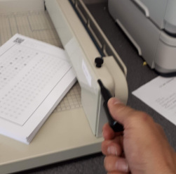
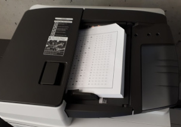

# Using CrowdMark in CS

SFU (or CS?) had a subscription to [CrowdMark](https://crowdmark.com/) and we can use it for exams in the School.


## Getting Started

Instructors can start by going to [to SFU sign-in page](https://app.crowdmark.com/sign-in/sfu) and linking their SFU account to CrowdMark. You can continue to sign in this way, or do a password reset and set a password so you can use their normal log-in page.

Overall, the [CrowdMark help](https://crowdmark.com/help/) is very good, and I won't replicate it here.


## Creating Your Exam

See the [CrowdMark help: creating an assessment template](https://crowdmark.com/help/creating-an-assessment-template/) for details, but the most critcal detail is to leave a 1.5&Prime; top margin for CrowdMark to do its thing. I do it like this in LaTeX:

```latex
\documentclass[11pt, letterpaper]{article}
\usepackage[top=1.5in,bottom=0.8in,left=0.8in,right=0.8in]{geometry}
```

On your cover page, leave the 3.5&Prime; gap for their name entry boxes: optional but worth it. [CrowdMark help: using automated matching](https://crowdmark.com/help/using-automated-matching/).

Create an &ldquo;administered&rdquo; assessment, turn on &ldquo;automated matching&rdquo; for student names, select single- or double-sided as appropriate, and drop in your PDF. You can go back and upload a new PDF if you don't get the alignment quite right.


## Student Data

CrowdMark needs a list of students and their emails, and if you're doing the name matching, metadata with their names and student numbers.

I have a written a quick program [gradelist-to-crowdmark.py](crowdmark/gradelist-to-crowdmark.py) that takes a CourSys grade CSV (&ldquo;Display All Grades&rdquo; &rarr; &ldquo;Export CSV&rdquo;) and produces `emails.txt` that you can copy-and-paste as the list of students ([CrowdMark help: enrolling students into an administered assessment](https://crowdmark.com/help/enrolling-students-into-an-administered-assessment/)), and `metadata.csv` that can be uploaded as student metadata ([CrowdMark help: adding student metadata](https://crowdmark.com/help/adding-student-metadata/)).


## Duplicating

CrowdMark will produce a big PDF document with booklets for each student (plus a few extra). You can ask the Undergrad Program Assistant to have the exam copied at Document Solutions: as long as they are told to staple in batches of *n* pages, they will. I find it easiest to exchange the big PDF with [Vault](https://vault.sfu.ca/).

It's theoretically possible to break the big PDF up, and send each booklet as a separate print job with stapling turned on. This is left as an exercise to the reader.

I prefer printing on white paper: it has better contrast when you scan it.


## The Exam

Give the exam as usual. Encorage students to write their name legibly and (if relevant) fill in the multiple choice bubbles with a fairly dark mark. (The automatic multiple choice grading likes a lot of contrast.)


## Removing Staples

The first step of scanning: get rid of the staples. There is a paper cutter in TASC1&nbsp;9206 that can cut about an inch of paper at a time. Conveniently, that's also about how many pages the copier can scan in a batch.

1. Take a pile of about an inch of exams (maybe a little less). Make sure they are all oriented the same way and squared-up. **Double-check the orientation!** If you cut some pages the wrong way, you'll probably lose the corners of the CrowdMark QR codes and have to identify a bunch of pages manually.
2. Line up the stapled corner in the cutter. I usually aim about a quarter inch below the staple. Screw down the clamp that holds the paper in place.
3. Move your fingers. Cut. Loosen the clamp.
4. Put that pile in the photocopier to scan (details below), and repeat.





## Scanning

[CrowdMark help: Scanning assessments](https://crowdmark.com/help/scanning-assessments/)

The scanned exam piles will be too large to email, so you'll need a USB key. **Scanning to a USB key is not where you expect** in the copier menu. 

1. Log into the copier and select: &ldquo;Device Functions&rdquo; &rarr; &ldquo;Print/Scan (Memory Storage Device)&rdquo; &rarr; &ldquo;Scan to Storage Device&rdquo;.
2. Set the scanning settings. I like 200&nbsp;dpi, full colour (for white paper, but greyscale is fine too), single- or double-sided as appropriate.
3. Cut the staples off a pile of exams.
4. Put that pile in the sheet feeder *with the cut corner away* from the feeder so they get detected/fed properly. Scan. Repeat.



The PDF documents may be upside down because of the way you put them in the scanner. Acrobat Pro can rotate them, as can Evince (the default Linux/Gnome PDF viewer), and my [rotate-pdf.py](crowdmark/rotate-pdf.py).

Upload the PDFs to CrowdMark and start marking.


## To CourSys

Once you export your grades from CrowdMark, my [crowdmark-to-coursys.py](crowdmark/crowdmark-to-coursys.py) will get them into a format that will import into CourSys. It will produce `coursys.csv` if you want to simply upload the grades for the activity.

The `coursys.json` that is produced can be uploaded as a &ldquo;marking detail&rdquo; rubric, as long as you set up the rubric to match the questions in CrowdMark.


